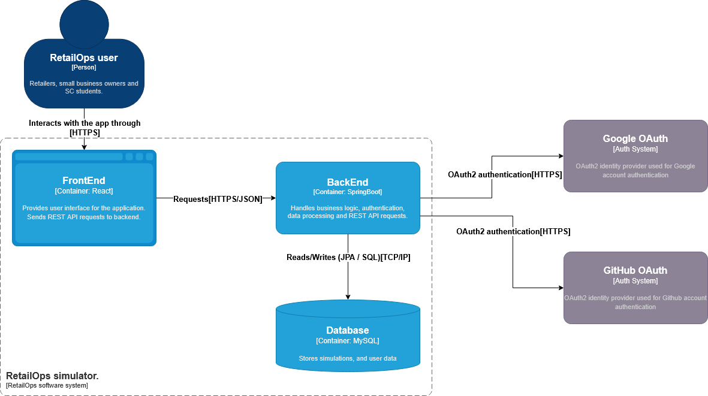

# RetailOps

## About the Project

**RetailOps** is an interactive web application for simulating retail inventory management, helping users make smarter decisions under uncertainty. It supports classic inventory control models such as Newsvendor, EOQ (Economic Order Quantity), ABC Analysis, and Critical Ratio. By modeling real-world retail scenarios, RetailOps shows how inventory decisions impact business performance.

Retailers constantly navigate two competing risks:

* Overstocking – incurring storage costs and potential waste

* Understocking – losing sales and disappointing customers

With **RetailOps**, users can:

* Input demand, cost, and inventory parameters for individual products or entire shops, including expected demand, variability, holding costs, and penalties for stockouts.
* Simulate different inventory scenarios under uncertainty using classic models:

  1. **Newsvendor** – analyze daily ordering decisions when demand is unpredictable, accounting for salvage values and lost sales penalties.
  2. **EOQ** (Economic Order Quantity) – calculate optimal order quantities, order cycles, and total costs for products with stable demand.
  3. **ABC** Analysis – categorize products based on sales value, demand, or both, helping prioritize which items need more attention or tighter inventory control.

* Receive actionable recommendations for optimal order quantities, reorder points, and inventory allocation to minimize costs and maximize service levels.

* Prioritize products and resources effectively using insights from ABC classification, Critical Ratio, and Monte Carlo simulations, so you can focus on high-impact items and improve overall inventory performance.
* Perform “__what-if__” analytics to compare scenarios, adjust service levels, or test alternative thresholds, giving you confidence in strategic decisions.
*  Export PDF reports summarizing your simulation for insights.

---
## System Architecture



---

## Key Features

* Newsvendor Simulation: Daily ordering decisions under random demand for perishable
  goods
* Calculation of optimal inventory order quantities
* ABC Analysis: Prioritize products based on consumption value.
* Analytics and Reporting
* Interactive user interface for parameter input
* Authentication using OAuth2 providers
* Responsive frontend design
* Separation of frontend and backend services
* REST-based communication between components

---

## Technology Stack

### Frontend

* React
* TypeScript
* TailwindCSS
* Shadcn ui
* Zustand (state management)

### Backend

* Spring Boot
* REST API
* OAuth2 Authentication (Google / GitHub)

### Development Tools

* GitHub for version control
* Draw.io for architecture diagrams
* C4 Model for system architecture

---

## API Documentation

The backend REST API for RetailOps is fully documented and available interactively via SwaggerHub.  
You can explore all endpoints, try requests, and see response examples here:

🔗 [RetailOps API on SwaggerHub](https://app.swaggerhub.com/apis/ANALYSTDATA/retailops-inventory-optimization-api/v1.0-sim)

---

## Architecture Overview

The application follows a **client-server architecture** based on the C4 container model.

System components:

* **User Browser** – interacts with the web interface
* **React Frontend** – handles the user interface and input validation
* **Spring Boot Backend** – processes requests and performs calculations
* **Authentication Providers** – Google and GitHub OAuth2 services

The frontend communicates with the backend using REST APIs, while the backend manages authentication and business logic.

---

## Project Structure

```
RetailOps
│
├── backend
│   └── Spring Boot application
│
├── frontend
│   └── React + TypeScript application
│
├── img
│   └── architecture diagrams and screenshots
│
└── README.md
```

---

## Installation

### 1. Clone the repository

```
git clone https://github.com/mariegutiz/retailops.git
cd retailops
```

---

### 2. Start the Backend

```
cd backend
./mvnw spring-boot:run
```

The backend server will start on:

```
http://localhost:8080
```

---

### 3. Start the Frontend

```
cd frontend
npm install
npm run dev
```

The frontend application will start on:

```
http://localhost:5173
```

---

****Example Usage****

1. Open the app in your browser and create a shop by providing a shop name.
2. Set preferences in the Settings tab, including currency format ($, €, etc.).
3. Check Overview to see past simulations.
4. Add Products in the Inventory tab:
   Add manually or import sample products (Florist or Cafeteria).
   Provide name, SKU, cost, price, description, and category. 
5. Add Inventory: Use Add to Inventory in the product library. 
6. Review Stock:
   * Check inventory levels and ABC classification (based on sales value = quantity × price).
   * See Critical Ratio, optimal order quantity (Q*), and profit/loss from Monte Carlo simulations.
7. Run Simulations:
   * Newsvendor – Simulate uncertain demand. Enter expected demand, variability (standard deviation), salvage value, and penalties.
   *  EOQ – Enter demand, fixed cost, and holding cost. Simulator provides Q*, cycle, and number of orders.
   * ABC Analysis – Classic (based on sales value) or Advanced (incorporates demand) to categorize products.

8. Analytics (What-If Scenarios):
   * Compare Newsvendor service levels against past simulations.
   * Compare EOQ parameters against previous results.
   * Adjust ABC thresholds (e.g., A: 80%, B: 95%, C: >95%) and compare outcomes.
9. Generate Reports: Export PDF reports summarizing your specific simulation for insights or stakeholders. 
---

## Future Improvements

* Interactive demand distribution visualization
* Extended analytics for inventory strategies
* Deployment to cloud infrastructure
* AI-driven decision support
---

## Author

Developer -Mariela Gutierrez [@mariegutiz](https://github.com/mariegutiz)
